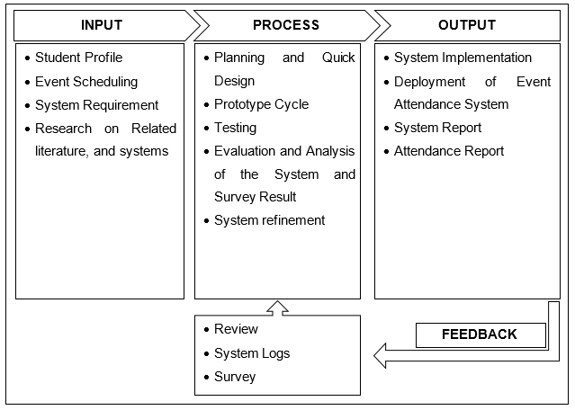
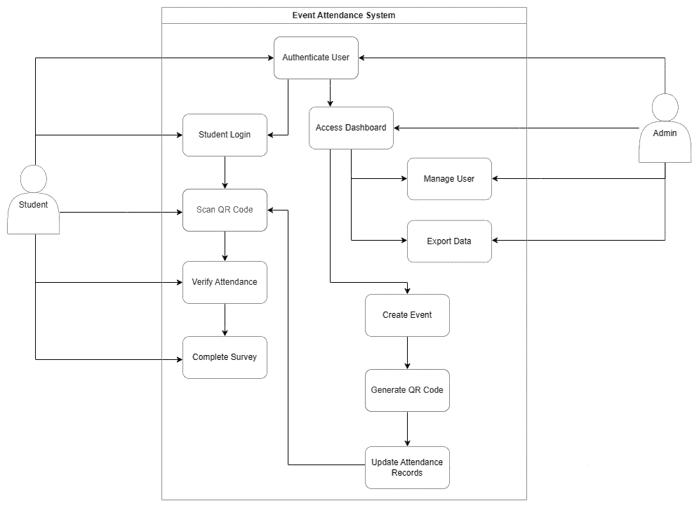
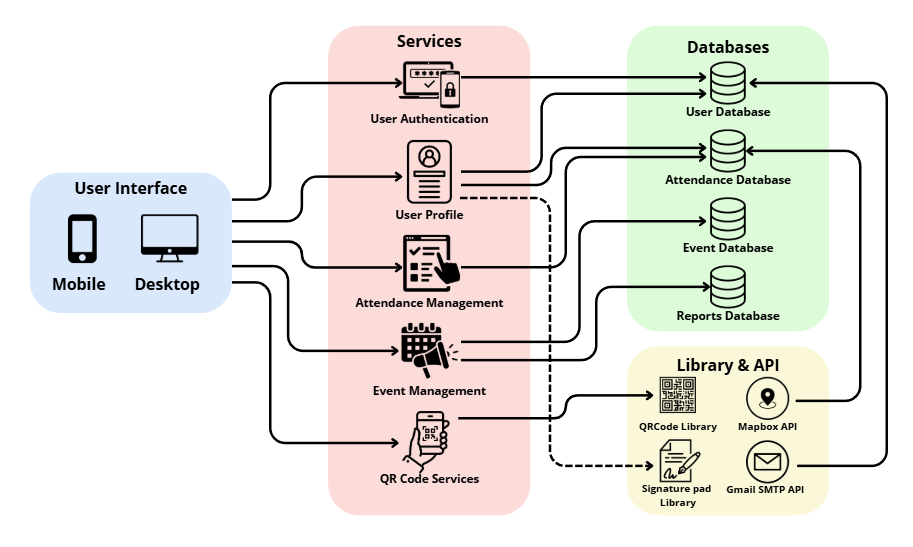
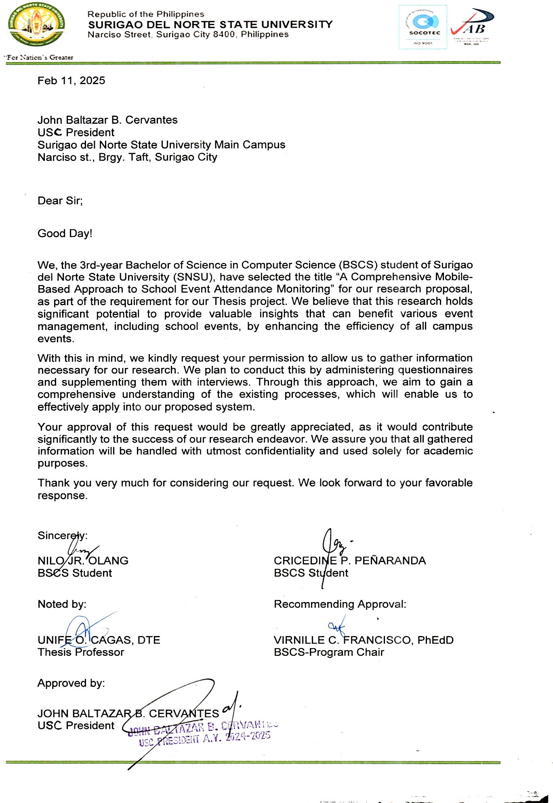
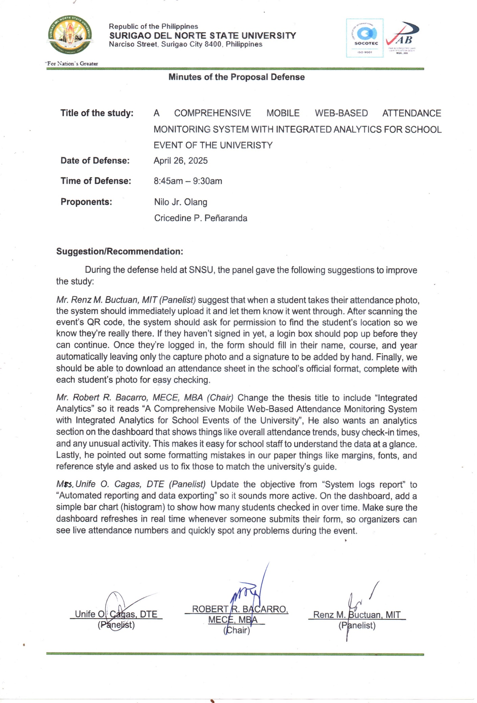
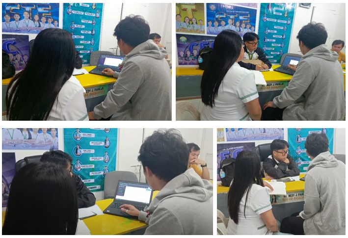

# A COMPREHENSIVE MOBILE WEB-BASED ATTENDANCE MONITORING SYSTEM WITH INTEGRATED ANALYTICS FOR SCHOOL EVENT OF THE UNIVERSITY

**Thesis Presented to**

**The Faculty of the College of Engineering & Information Technology**

**Surigao del Norte State University**

**In Partial Fulfillment**

**of the Requirements for the Degree**

**Bachelor of Science in Computer Science**

**By:**

**Nilo Jr. Olang**

**Cricedine P. Peñaranda**

**May 2025**

# TABLE OF CONTENTS

- [**CHAPTER 1: INTRODUCTION**](#chapter-1)
  - [Statement of the Problem](#statement-of-the-problem)
  - [General Objectives](#general-objectives)
  - [Specific Objectives](#specific-objectives)
  - [Scope and Limitation](#scope-and-limitation)
  - [Significance of the Study](#significance-of-the-study)
  - [Definition of Terms](#definition-of-terms)

- [**CHAPTER 2: REVIEW OF RELATED LITERATURE**](#chapter-2)
  - [Synthesis of Related Literature](#synthesis-of-related-literature)

- [**CHAPTER 3: TECHNICAL SPECIFICATIONS**](#chapter-3)
  - [Theoretical Framework](#theoretical-framework)
  - [Conceptual Framework](#conceptual-framework)
  - [Requirements Analysis](#requirements-analysis)

- [**CHAPTER 4: METHODOLOGY**](#chapter-4)
  - [Data Gathering](#data-gathering)
  - [Instruments](#instruments)
  - [Data Collection](#data-collection)
  - [Data Analysis](#data-analysis)

- [**REFERENCES**](#references)

- [**APPENDICES**](#appendices)
  - [APPENDIX A: Letter to conduct the study](#appendix-a)
  - [APPENDIX B: Interview Guide](#appendix-b)
  - [APPENDIX C: Documentation](#appendix-c)
  - [APPENDIX D: Curriculum Vitae](#appendix-d)

## Clarifications

### Session 2025-10-09

- Q: The thesis document states the system is "based on Django" but the deployment letter describes "Next.js with TypeScript" as the backend. Which technology stack is actually being used? → A: Next.js only (thesis needs correction)
- Q: The deployment letter is dated April 15, 2025, but it states "Following our proposal defense on April 26, 2025" (11 days in the future). What is the correct chronological order? → A: Letter date is correct, remove defense date reference

# CHAPTER 1 {#chapter-1}

# INTRODUCTION

School events are significant as they engage students and enhance learning; however, tracking participants at these events remains a challenge, especially for large universities like SNSU. For example, recording students\' attendance using pen and paper can take significant time and is prone to loss. Furthermore, it takes time for the university administration to manage and process attendance records. \[5\]. Most schools, including SNSU, have not been successful in putting in place a full and secure system to avoid fraud despite increased technology. Furthermore, the lack of real-time verification of attendance records makes it difficult for managers to properly manage event attendance. An efficient system that provides instant verification and automates the tracking of attendance can assist schools to perform better and make fewer errors.

Several studies have researched ways to make school attendance tracking better. Studies show that adding cloud computing and machine learning to attendance systems greatly improves precision and efficiency \[6\]. Cloud databases and QR code integration in web-based attendance management systems may speed up the procedure by minimizing the errors and time \[6\]. More research shows that RFID tags work well as a way to identify students and send their attendance information through SMS alerts \[7\]. Even though these methods help track attendance better, some students may not be able to use them because the devices are too expensive and not all students have their own devices.

Despite advancements in technology, attendance fraud, inefficient record management, and delayed event monitoring persist in many educational settings. These institutions still use outdated logging methods such as manual logging and signing on paper, which are time-consuming, error-prone, and can lead to attendance dishonesty (signing on behalf of someone). Traditional systems lack robust verification, enabling students to alter records or log proxy attendance. Administrators struggle to detect irregularities due to the absence of real-time tools and personnel constraints. SNSU and similar institutions urgently need a secure, adaptable system to ensure accurate attendance monitoring. Some schools use time-consuming, prone to errors, and slow manual verification procedures to address this problem. Furthermore, the usability of some digital attendance solutions is limited since they are not compatible with all devices. As a result, SNSU and similar institutions need a system that is safe, effective, and flexible to guarantee accurate attendance monitoring during educational events.

This study suggests creating a mobile web-based attendance system that combines GPS tracking, QR code scanning, and selfie verification with event-specific backgrounds to address these difficulties. This system innovation offers real-time attendance tracking, not only improving accuracy, but also preventing fraudulent attendance practices by students. According to research on biometric authentication and location-based tracking, these methods efficiently and student-friendly confirm a student\'s physical attendance at an event \[3\]. Since it is designed to operate with mobile web browsers, students remove the need for downloading the app. The system can guarantee accessibility and reliability by utilizing cloud storage and secure authentication methods, which makes it the perfect choice for universities like SNSU wanting to enhance the event attendance tracking.

## Statement of the Problem {#statement-of-the-problem}

Conventional methods of monitoring attendance at school events are unreliable, error-prone, and easily manipulated. To prevent attendance fraud, reduce administrative burden, lower implementation costs, and enable real-time attendance monitoring, institutions require a reliable and automated solution. To enhance the accuracy, reliability, and efficiency of attendance logging at SNSU and similar institutions, this research proposes to develop a mobile web-based event attendance tracking system.

## General Objectives {#general-objectives}

This study is to system that improves the accuracy, security, and convenience of tracking event attendance. The system utilizes GPS tracking along with QR code scanning and biometric verification to provide a safe and reliable mechanism for recording attendance at SNSU school events.

## Specific Objectives {#specific-objectives}

Specifically, this system aimed to:

1. Develop an Event Attendance Management.

2. QR Code-Based Attendance Tracking.

3. Locate and Visual Verification Features.

4. Automated Reporting and Data Analytics.

## Scope and Limitation {#scope-and-limitation}

This study was conducted at Surigao del Norte State University (SNSU) from the second semester to the first semester of the 2025-2026 academic year. This system uses QR code scanning, GPS location, and selfie verification to improve attendance for school events. The proposed system will be tested at SNSU and evaluated for its accuracy, security, and efficiency.

The core features of the event attendance system include:

### Develop an Event Attendance Management

1. Develop an event attendance management system using Next.js with TypeScript for full-stack development

2. Integrate a student's authentication system to secure event data and students information using JWT (JSON Web Tokens)

3. Implement a responsive web-based interface accessible via mobile browsers for both students and moderators

### QR Code-Based Attendance Tracking

1. Generate unique QR codes for each event.

2. Implement encryption on QR codes.

### Locate and Visual Verification Features

1. Integrate location-based technologies to track student at scheduled event and verify participation.

2. Implement selfie verification with event backgrounds to prevent proxy attendance.

### Automated Reporting and Data Analytics

1. Real-time attendance updates.

2. Generate attendance reports via CSV or PDF Format.

3. Maintain system logs to track students and moderator activities.

However, there are certain limitations to the Event Attendance System, including:

1. The system requires a good internet connection for real-time updates, which might fail in areas with poor network coverage.

2. Environmental variables including buildings, weather, and device limits can impact GPS accuracy.

3. Poor lighting and photos might result in misleading rejection during verification.

4. The system is intended for school-related events and may require adjustments for larger events.

5. GPS monitoring and face verification raise privacy concerns and require strict data protection procedures to ensure students security.

## Significance of the Study {#significance-of-the-study}

This study aims to improve the effectiveness and efficiency of attendance monitoring in campus events. Some University are still using the old way of marking attendance and it take time to record the attendance because of long queue, thereby rendering monitoring of attendance ineffective and unreliable. The proposed system offers a computerized alternative that offers secure, reliable, and convenient attendance monitoring.

The project beneficial to the following:

> **For University:** The system ensures an efficient and fraud-resistant method for tracking student attendance, reducing the need for manual sign-in attendance and event long queue.

**For Administrators:** The real-time monitoring capability allows administrators to easily export student data, including attendance lists and other relevant information.

**For Students:** The system minimizes the time and effort required for attendance confirmation while ensuring fairness and transparency in attendance tracking.

**For Future Researchers:** This study provides a foundation for further research on improving attendance monitoring systems through emerging technologies such as artificial intelligence, cloud computing, and biometric verification.

## Definition of Terms {#definition-of-terms}

**Attendance Fraud:** The act of falsifying attendance records, such as proxy sign-ins or false check-ins.

**GPS Tracking:** The use of a mobile device's Global Positioning System to verify a student's physical presence at an event location.

**QR Code Scanning:** A process where students scan a unique QR code to confirm their attendance at an event.

**Selfie Verification:** A method of identity verification where students take a selfie with the event background to confirm attendance.

**Real-Time Monitoring:** The ability to track and manage attendance records instantly through a mobile or web-based platform.

**Cloud-Based Storage:** A digital database that securely stores attendance records for easy access and retrieval.

**RFID Technology:** A wireless system using radio waves to identify and track tags attached to objects (e.g., student cards) for automated attendance logging.

**Biometric:** The use of unique biological or behavioral characteristics for identification and authentication.

**Authentication:** A process of verifying the identity of a user, computer, or process.

**SMS:** Short message service that allows the exchange of short text messages between devices.

**NFC:** Near Field Communication a short-range wireless technology that allows devices to communicate with each other when they are in close proximity, typically within 4 centimeters.

**AI:** Is a technologies that enable computers to perform a variety of advanced functions, including the ability to see, understand and translate spoken and written language, analyze data, and make recommendations.

**API:** Application programming interface a software intermediary that allows two applications to talk to each other.

**SDLC:** A structured process used to plan, design, develop, test, and deploy software.

**Data Analytics:** The process of examining raw data to find patterns, trends, and insights.

\*\*\*\*

# CHAPTER 2 {#chapter-2}

## REVIEW OF RELATED LITERATURE

The use of automated monitoring and RFID technologies has greatly improved attendance tracking in educational settings. Research demonstrated an intelligent system that uses CCTV monitoring and RFID to monitor student login and logout during vehicle boarding, assuring safety and accountability \[13\]. Similarly, the Activity Attendance tracking System (AAMS) has been launched to improve attendance tracking using RFID-based student cards, providing a more efficient alternative to traditional attendance-taking methods \[11\]. The efficiency of RFID technology in tracking student attendance has been confirmed by real-time attendance monitoring, in which RFID tags are automatically identified and stored in a database \[11\].

Recent improvements in mobile-based attendance tracking have eased attendance management procedures. One research study demonstrated the successful establishment of a student attendance system that uses an SMS Gateway to successfully convey attendance information to parents \[7\]. This prototype uses RFID detection to deliver messages to parents via SMS, highlighting the significance of real-time monitoring \[7\]. Furthermore, mobile applications have been identified as an efficient replacement for manual attendance methods, providing digital solutions that minimize administrative effort and time consumption \[5\]. These programs create automatic attendance records and reminders for absent children, which improves communication between educational institutions and parents \[5\].

Biometric authentication methods, such as fingerprint and face recognition systems, have also been investigated for attendance tracking. One research described a facial recognition-based attendance management system that reduces human interaction while resolving scalability, posture variation, and lighting issues \[10\]. This system improves accuracy in detecting student identities by utilizing advanced feature identification algorithms, even under shifting ambient circumstances. Furthermore, a portable fingerprint-based system based on Raspberry Pi technology has been suggested to track student attendance in real time, allowing instructors and parents to do so remotely \[9\]. This system recorded and processed attendance data with a 100% success rate, confirming its trustworthiness for educational institutions \[9\]. The combination of face and fingerprint authentication presents a highly secure alternative to traditional attendance methods, ensuring that only registered students are marked as present.

Several studies have focused on intelligent attendance systems that utilize advanced recognition technology to increase identification accuracy. One study developed a spatio-temporal human action identification-based system that combines skeletal gait recognition, body silhouette detection, and facial recognition to effectively monitor attendance \[3\]. This technique is very beneficial for overcoming identity masking issues, such as students donning face masks or changing clothes to avoid detection. Experimental findings showed that this system achieved 83.33% identification accuracy, even while students were wearing masks, making it a feasible choice for educational institutions that require extremely precise attendance verification \[3\].

Another area of study has focused on incorporating GPS and NFC-based attendance tracking devices, which provide low-cost and efficient options for monitoring attendance. One research proposed a GPS and NFC-based attendance monitoring system that allows students to record attendance using their own Android smartphones, avoiding the need for extra technological equipment. This technique allows moderators to track attendance faster than traditional roll-call systems, resulting in considerable reductions in classroom management time. Furthermore, the technology automates attendance tracking by recognizing student locations and validating their presence without the need for manual input.

## Synthesis of Related Literature {#synthesis-of-related-literature}

The analyzed studies highlight the importance of automation, accuracy, and fraud prevention in attendance tracking systems. The location-based and visual verification capabilities built into attendance tracking have considerably improved accuracy and security. According to studies, GPS tracking and face recognition-based verification help with real-time monitoring and proxy attendance prevention \[3\]. The technology guarantees that students are physically present at planned activities by combining location monitoring and selfie verification with event backdrops.

By including fraud protection, location-based verification, and real-time performance monitoring, SNSU\'s Event Attendance System provides a safe and scalable solution for event attendance tracking. The use of multi-factor authentication, real-time monitoring, and automated reporting results in a more accurate, secure, and efficient approach to attendance management. Future developments might include AI-driven analytics, face recognition technologies, and hybrid authentication models to improve verification procedures and maintain data integrity in educational institutions.\*\*\*\*

# CHAPTER 3 {#chapter-3}

## TECHNICAL SPECIFICATIONS

## Theoretical Framework {#theoretical-framework}

Developing an easy-to-use system for tracking attendance at school events is based on important ideas from technology, security, and online data storage. This study follows three main ideas: the Human-Computer Interaction \[14\], Biometric Authentication Models \[15\], and Cloud Computing Models \[16\].

Human-Computer Interaction (HCI) forms the foundation for designing intuitive user experiences in our attendance system. Like how your favorite apps are easy to navigate, we follow the same rules to make scanning QR codes and taking selfies quick and simple. This means students won't need special training to use it. The buttons and steps are placed where you'd expect them to be. A good design helps everyone, even those who aren't tech-savvy, to use the system without frustration \[14\].

This study also includes biometric authentication by using selfie verification and GPS tracking to make sure attendance is real. When you attend an event, the system makes you take a selfie (like unlocking your phone) and check your location. This matches international security standards for face recognition. No more signing papers for your friends. The integration of these technologies ensures that only legitimate attendees are recorded while maintaining compliance with identity verification standards \[15\].

Cloud computing is another key part of this system. Cloud computing allows attendance data to be stored online securely and updated in real-time. Moderators can check who came to events anytime, anywhere, no more lost paper sheets. The system automatically saves everything and can handle hundreds of students at once \[16\].

The study\'s theoretical foundation integrates HCI, Biometric Authentication Models, and Cloud Computing Models to address the core challenges of attendance tracking: fraud prevention, data reliability, and scalability. Facial recognition through selfie verification and reinforcing it with GPS-based location checks, the system ensures that only physically present students can log attendance. Meanwhile, cloud computing principles enable secure, real-time data storage and retrieval, eliminating the inefficiencies of manual record-keeping. Together, these frameworks provide a robust foundation for a system that balances security, accessibility, and user-centric design, while addressing the limitations of traditional methods identified in the literature.

## Conceptual Framework {#conceptual-framework}

The conceptual framework of this study demonstrates how the Input, Process, and Output (IPO) diagram and how components of the system interact with one another. This IPO explained how the system receives information, processes it, and generates results to provide an ideal and efficient method for tracking attendance at school activities.

**Figure 1: IPO Model of the study**

The \"Event Attendance System\" begins with the input phase, which involves creating students' profiles, organizing events, generating QR codes, analyzing system needs, and researching related literature and current systems. Furthermore, the assessment and analysis of obtained data ensures that the system is in line with the user's requirements and operational goals. The process phase includes planning, analysis, and fast design, followed by data analysis and iterative prototyping to fine-tune system functionality. The procedure also includes rigorous testing and assessment, such as statistical survey analysis, to determine the system\'s efficiency and correctness. The output phase includes the implementation, deployment, and creation of the event attendance tracking system and attendance reports. A crucial component of the framework is feedback, which is gathered through system logs, surveys, and review mechanisms, enabling continuous improvement and refinement of the system.

## Requirements Analysis {#requirements-analysis}

### Hardware Requirements

**Computer Specifications:**

| Component | Minimum Specification                |
| --------- | ------------------------------------ |
| Processor | Intel Core i5 / AMD Ryzen 5 (4-core) |
| RAM       | 8 GB DDR4                            |
| Storage   | 256 GB SSD                           |
| GPU       | Integrated GPU                       |
| OS        | Windows 10 / macOS Monterey          |

**Mobile Specification:**

| Component | Minimum Specification      |
| --------- | -------------------------- |
| OS        | Android 10 / iOS 14        |
| Processor | Snapdragon 600 / Apple A10 |
| RAM       | 3 GB                       |
| Storage   | 32 GB                      |
| Camera    | 12 MP rear / 5 MP front    |
| GPS       | Assisted GPS (A-GPS)       |
| Battery   | 3000 mAh                   |
| Screen    | 5.5" HD (720p)             |
| Network   | 4G LTE                     |

### Software Requirements

- GitHub -- For version control and project documentation.

- Django -- Backend framework for system development.

- Render -- Deployment platform for hosting the web-based application.

- PostgreSQL -- Database management system for handling events and students data.

- TailwindCSS -- Frontend framework for designing the students interface.

- Mapbox API -- For GPS tracking and location-based attendance verification.

- Cloudinary -- For image storage, including event selfies for authentication.

### Non-Functional and Functional Requirements

| **Functional**                                                                                                                                                        | **Non-Functional**                                                                                             |
| --------------------------------------------------------------------------------------------------------------------------------------------------------------------- | -------------------------------------------------------------------------------------------------------------- |
| - User Authentication - Attendance Verification - Event Management - Attendance Form - Dashboard & Reports - System Logs & Monitoring - Data Export | - Performance - Scalability - Security - Usability - Reliability - Data Storage - Compliance |

**Table 1: Functional and Non-Functional Requirements**

### Students Requirements

**Students** should be able to simply register and log in using their credentials. When attending an event, they may confirm their attendance by scanning a QR code, utilizing GPS tracking, and shooting a selfie at the event venue.

**Administrators** can easily establish and manage events, measure system activity, manage students, and produce reports to assess attendance trends and enhance future events.

### Use Case Diagram

**Figure 2: Use-case Diagram for Event Attendance**

The diagram shows the roles of students, the system, and admins.

The use case diagram (Figure 2) visually represents the key functionalities of the Event Attendance System and the positions of its actors. Students participate with the system through signing in, scanning QR codes, checking attendance, and filling out questionnaires. Administrators may manage students, create events, and export attendance data. The system automates essential tasks, including user identification, QR code production, and attendance record changes. These interactions guarantee that the event attendance monitoring system is safe and efficient, with real-time data updates and record keeping for the SNSU.

### System Design

**Figure 3: Low-Level System Design of Event Attendance System**

The system follows a modular approach, ensuring scalability and security. It consists of:

**Figure 3. Low-Level System Design of Event Attendance System.**

The attendance management system features various essential modules designed for tracking attendance, ensuring both simplicity and security. This system is comprised of multiple components, including the student interface, services, library & API, and databases. The services module is responsible for managing students' registration, authentication, and assigning roles, which ensures that each user\'s access is restricted based on their privileges. Additionally, the attendance and event management responsibilities fall to the student organizer (USC) to oversee student activities. The QR code scanner\'s verification module incorporates multiple checks, such as a selfie taken at the event, GPS location tracking through the Mapbox API, and digital signatures captured via the signature pad library to prevent any proxy sign-ins. All relevant data, including students\' profiles, event specifics, attendance records, and reports, is stored within the database module, which includes separate databases for students, attendance, events, and reports. This structure allows administrators to effectively monitor and organize attendance and events while generating reports stored in the database. The event management module enables administrators to create, schedule, and oversee events while also integrating feedback forms for participants. The system incorporates QR code services that permit event organizers to generate and scan QR codes, facilitating smooth check-ins. To improve functionality further, the Gmail SMTP API is utilized for sending email notifications about event updates and attendance confirmations. Before finalizing attendance records, the data processing module ensures that all information is verified and validated for accuracy.

\*\*\*\*

# CHAPTER 4 {#chapter-4}

## METHODOLOGY

This thesis chapter discussed the methods and sources from which the researcher gathered data for the current study. The Event Attendance System was developed using a combination of agile and Rapid Application Development (RAD) under the software development life cycle (SDLC) is the methodology used. This explains various methodologies, including the phases of Agile and RAD, which are essential for the developers and are: requirement gathering, design and prototyping, development, testing and students\' feedback, and deployment and review.

**Figure 4: Agile and RAD Methodology Model**

Figure 4 shows the combination of Agile and RAD development processes. This methodology was employed to systematically guide the development of the Event Attendance System (EAS). This initial planning is the starting point of the development, where planning ensures that the system requirements are organized before the design and prototyping begin. The cyclical structure of the model represents the core phases of the phase development: requirement gathering, design and prototyping, development, testing, and students\' feedback. These phases indicate a continuous and flexible workflow, where each step is interconnected and can be revisited based on the testing and students\' feedback. lastly, the deployment marks the final stage where the system is launched for real-world use and ensures the full deployment of the Event Attendance System (EAS).

Based on the gathered requirements phase, the system features and functionalities were identified based on the data collected from the event organizer (University Student Council) and Students. This stage involved interviews with the USC to understand their attendance monitoring challenges and surveys with the students to determine usability expectations. The collected data provided valuable insights into students' needs, guiding the overall system design and development.

Once the requirements were established, the design and prototyping phase commenced, focusing on the system students interface (UI) and architecture (Figure 2 and Figure 3), with this system flow diagrams were created to map out the system functionality. A working prototype was developed, allowing the USC to interact with the system and provide feedback on its usability. This rapid prototyping approach enabled developers to refine the design before proceeding to full-scale development.

The development phase is where the coding and implementation of the features outlined in the design phase. The system was build using Django (backend), SQLITE (database) for data management, Mapbox (API) for location tracking, QRcode (Library) for generating a link to directly go to the attendance form which after creating an Event by the USC and TailwindCss (frontend) are the students interface, throughout this phase, Agile principles were applied to ensure that iterative updates were made based on feedback from students and USC.

After development, the system will undergo Testing and student feedback to validate its functionality and usability. Alpha and beta testing were conducted to identify potential issues, and users' acceptance testing (UAT) was carried out with event organizers and students. Surveys and structured interviews were used to gather feedback, ensuring that any usability concerns were addressed before deployment.

The final stage is the deployment process which will release the official version of the system to use in school events. The proper training session was provided to organizers to facilitate the smooth adoption of the system. System performance was monitored through students\' feedback and system logs to assess its effectiveness, then a post-deployment review was conducted to gather insights for future enhancements, ensuring that the system remains adaptable to large-scale requirements.

By integrating Agile and RAD methodologies, the development process successfully created a reliable Event Attendance System. The iterative approach allowed for continuous improvements, ensuring that the final product met the needs of both event organizers and students. This methodology provided a structured framework with a flexible framework, making the system development process efficient and students-centered.

## Data Gathering {#data-gathering}

**Primary Data:** The data is being collected from the University Student Council (USC) as event organizers and students as event attendees. To ensure the understanding of the needs in an event, we interviewed with the USC to identify the challenges they faced in monitoring attendance, and surveys were distributed to students to assess their expectations and usability preferences for the system. The collected data provided valuable insight into the key functionalities required for the Event Attendance System which will track all the attendance of the student attendees.

**Secondary Data:** Additional information was gathered from websites, articles, and system development capstone projects that discuss online attendance management solutions. These sources provided a valuable insights into the existing attendance tracking methods, helping to refine the system's design and implementation based on best practices from similar projects.

## Instruments {#instruments}

The researcher used survey and questionnaires to collect data from interview, survey questionnaire, and observation method.

**Interviews:** The conducted with USC representatives to gather qualitative insight into their attendance monitoring challenges.

**Survey Questionnaire:** distributed to students to assess usability expectations and students experience preferences. The questionnaires included Likert-scale questions to measure student satisfaction and feedback on automated attendance systems.

## Data Collection {#data-collection}

The data collection process was conducted in multiple stages to ensure the accuracy and reliability of the information gathered. Initially, interviews with USC representatives were scheduled, recorded, and transcribed for analysis. Following the interviews, survey questionnaires were distributed digitally to students, with responses being automatically recorded for statistical evaluation. The researcher also conducted a live observation of university events, providing first-hand data on attendance monitoring practices, enabling a clearer understanding of the limitations of existing methods. All collected data were systematically organized and validated to eliminate inconsistencies before proceeding with the system design and development phase.

## Data Analysis {#data-analysis}

After gathering the necessary data, a systematic approach was applied to analyze the information and extract meaningful patterns. Qualitative data from interviews with the USC were examined to identify recurring issues in the traditional attendance process, such as manual record sign-in inefficiencies and verification challenges. Quantitative data from student surveys were statistically analyzed to determine trends in students' preferences, such as the preferred mode of checking attendance, ease of use, and technology adoption rate. The result from both qualitative and quantitative analyses served as a foundation for designing system features that addressed the specific needs of both USC and students.

# REFERENCES {#references}

1. Chiang, T.-W., Yang, C.-Y., Chiou, G.-J., Lin, F. Y.-S., Lin, Y.-N., Shen, V. R. L., Juang, T.-Y., & Lin, C.-Y. (2022). Development and Evaluation of an Attendance Tracking System Using Smartphones with GPS and NFC. Applied Artificial Intelligence, 36(1). DOI: <https://doi.org/10.1080/08839514.2022.2083796>

2. Saracostti, M., De Toro, X., Rossi, A., Lara, L. G., & Sotomayor, M. B. (2022). Implementation of a web-based system to measure, monitor, and promote school engagement strategies. A Chilean experience. Frontiers in Psychology, 13. DOI: <https://doi.org/10.3389/fpsyg.2022.980902>

3. Tsai, M.-F. and Li, M.-H. 2022. Intelligent attendance monitoring system with spatio-temporal human action recognition. Soft Computing. 27, 8 (Oct. 2022), 5003--5019. DOI: <https://doi.org/10.1007/s00500-022-07582-y>

4. Farag, W. and Abouelela, M.M.M. 2022. Low-Cost Active Monitoring of Attendance using Passive RFID Technology. JITEKI : Jurnal Ilmiah Teknik Elektro Komputer dan Informatika. 8, 4 (Dec. 2022), 552. DOI: <https://doi.org/10.26555/jiteki.v8i4.25168>

5. Mulay, S.S. 2022. Student attendance application. Indian Scientific Journal Of Research In Engineering And Management. 06, 11 (Nov. 2022). DOI: <https://doi.org/10.55041/ijsrem16984>

6. Caytuiro-Silva, N. et al. 2024. Optimizing Attendance Management in Educational Institutions Through Mobile Technologies: A Machine Learning and Cloud Computing Approach. International journal of interactive mobile technologies. 18, 12 (Jun. 2024), 112--128. DOI: <https://doi.org/10.3991/ijim.v18i12.46917>

7. Satria, D., Hidayat, T., Hidayat, M.A. and Zakaria, Z. 2018. Application of SMS Gateway on Attendance Detection Systems using RFID. 1, 2 (Oct. 2018). DOI: <https://doi.org/10.32672/JNKTI.V1I2.778>

8. Mrabet, H. and Ait Moussa, A. 2020. IoT-School Attendance System Using RFID Technology. International Journal of Interactive Mobile Technologies (ijim). 14, 14 (Aug. 2020), 95--108. DOI: <https://doi.org/10.3991/IJIM.V14I14.14625>

9. Syahrul, M. and Wicaksono, F. 2020. Design and Application of a Portable Fingerprint System for Student Attendance Web-Based and Telegram Using Raspberry Pi. 879, 1 (Jul. 2020), 012101. DOI: <https://doi.org/10.1088/1757-899X/879/1/012101>

10. B, A., C, A., K. N, C. and R, R. 2018. Attendance Monitoring System Using Face Recognition. International journal of engineering research and technology. 6, 13 (Apr. 2018).

11. Adderley, R., Sanim Mohd Fauzi, S., Ayub, I.M., Fikri Jamaluddin, M.N., Puspitasari, I. and Okfalisa, O. 2020. Design and development of activity attendance monitoring system based on RFID. Indonesian Journal of Electrical Engineering and Computer Science. 17, 1 (Jan. 2020), 500--507. DOI: <https://doi.org/10.11591/IJEECS.V17.I1.PP500-507>

12. Febrifyaning, R., Hamidah, M.N., Arizal, A. and Setyatama, F. 2021. Smart school management system of presence monitoring teacher as a realtime with rad (rapid application development) method at khadijah high school surabaya. 6, 1 (Jun. 2021).

13. Vinay, S.V., Kumar, V.S., Shukla, S., Kumar, R. and Devanagavi, G.D. 2020. Attendance monitoring Using IOT for transportation Systems. (Mar. 2020).

14. J. Nielsen, Usability Engineering, Morgan Kaufmann, 1993.

15. Jain, A. K., Ross, A., & Prabhakar, S. (2004). An introduction to biometric recognition. _IEEE Transactions on Circuits and Systems for Video Technology, 14_(1), 4-20. <https://doi.org/10.1109/TCSVT.2003.818349>

16. Mell, P., & Grance, T. (2011). The NIST definition of cloud computing. _National Institute of Standards and Technology Special Publication, 800_(145), 7. <https://doi.org/10.6028/NIST.SP.800-145>

# APPENDICES {#appendices}

\*\*\*\*

## APPENDIX A {#appendix-a}

### Letter to conduct the study

#### Inside the 'Letter to Conduct the Study' Images

Dear Sir;
Good Day!

We, the 3rd-year Bachelor of Science in Computer Science (BSCS) student of Surigao del Norte State University (SNSU), have selected the title “A Comprehensive Mobile-Based Approach to School Event Attendance Monitoring” for our research proposal, as part of the requirement for our Thesis project. We believe that this research holds significant potential to provide valuable insights that can benefit various event management, including school events, by enhancing the efficiency of all campus events.

With this in mind, we kindly request your permission to allow us to gather information necessary for our research. We plan to conduct this by administering questionnaires and supplementing them with interviews. Through this approach, we aim to gain a comprehensive understanding of the existing processes, which will enable us to effectively apply into our proposed system.

Your approval of this request would be greatly appreciated, as it would contribute significantly to the success of our research endeavor. We assure you that all gathered information will be handled with utmost confidentiality and used solely for academic purposes.

Thank you very much for considering our request. We look forward to your favorable response.

### Minutes of the Proposal Defense

#### Inside the 'Minutes of the Proposal Defense' Images

##### Suggestion/Recommendation

During the defense held at SNSU, the panel gave the following suggestions to improve the study:

Mr. Renz M. Buctuan, MIT (Panelist) suggest that when a student takes their attendance photo, the system should immediately upload it and let them know it went through. After scanning the event’s QR code, the system should ask for permission to find the student’s location so we know they’re really there. If they haven’t signed in yet, a login box should pop up before they can continue. Once they’re logged in, the form should fill in their name, course, and year automatically leaving only the capture photo and a signature to be added by hand. Finally, we should be able to download an attendance sheet in the school’s official format, complete with each student’s photo for easy checking.

Mr. Robert R. Bacarro, MECE, MBA (Chair) Change the thesis title to include “Integrated Analytics” so it reads “A Comprehensive Mobile Web-Based Attendance Monitoring System with Integrated Analytics for School Events of the University”, He also wants an analytics section on the dashboard that shows things like overall attendance trends, busy check-in times, and any unusual activity. This makes it easy for school staff to understand the data at a glance. Lastly, he pointed out some formatting mistakes in our paper things like margins, fonts, and reference style and asked us to fix those to match the university’s guide.

Mrs. Unife O. Cagas, DTE (Panelist) Update the objective from “System logs report” to “Automated reporting and data exporting” so it sounds more active. On the dashboard, add a simple bar chart (histogram) to show how many students checked in over time. Make sure the dashboard refreshes in real time whenever someone submits their form, so organizers can see live attendance numbers and quickly spot any problems during the event.

## APPENDIX B {#appendix-b}

### Interview Guide

**Interview Questionnaire**

| Question                                                                                                                                       |
| ---------------------------------------------------------------------------------------------------------------------------------------------- |
| 1. How attendance currently is recorded in school events?                                                                                      |
| 2. What challenges have you encountered when marking attendance at events?                                                                     |
| 3. Have you experienced or witnessed attendance fraud (e.g., proxy attendance, fake sign-ins)?                                                 |
| 4. How long does it usually take to check in attendees at an event?                                                                            |
| 5. What difficulties do you face when checking in at events?                                                                                   |
| 6. Have you ever had issues with your attendance not being recorded properly?                                                                  |
| 7. Would you be open to using a mobile app for attendance tracking?                                                                            |
| 8. What concerns do you have about using technology (such as GPS, QR codes, or selfies) for attendance?                                        |
| 9. What are the biggest difficulties you face in verifying attendance at school events?                                                        |
| 10. How do you ensure that only registered attendees are counted?                                                                              |
| 11. How do you manage attendance data after the event?                                                                                         |
| 12. Would an automated system (using QR codes, GPS, and verification features) improve efficiency?                                             |
| 13. What policies or guidelines does the school currently have for event attendance monitoring?                                                |
| 14. How do you handle disputes regarding incorrect or missing attendance records?                                                              |
| 15. Would a mobile-based system help improve accountability and record-keeping?                                                                |
| 16. What security concerns do you have about using digital attendance tracking methods?                                                        |
| 17. How would you measure the success of an improved attendance tracking system?                                                               |
| 18. Do you think students and staff would easily adapt to a digital attendance system? What challenges do you foresee?                         |
| 19. If a mobile-based attendance system were implemented, what features would be most useful to you?                                           |
| 20. What improvements or changes would you suggest to enhance the design and usability of this attendance form in the event attendance system? |

\*\*\*\*

## APPENDIX C {#appendix-c}

### Documentation

**System Proposal**

We formally requested permission from the University Student Council (USC) President at Surigao del Norte State University (SNSU) to discuss our proposed Mobile Web-Based Event Attendance System. During the interview held at the USC office on the SNSU main campus, we inquired whether the USC was familiar with advanced attendance verification technologies such as QR codes, GPS tracking, and selfie authentication. The USC President highlighted challenges in the current manual attendance process, including time inefficiencies, susceptibility to proxy sign-ins, and delayed data consolidation. We demonstrated how our system's integration of QR code scanning, GPS location validation, and selfie verification with event-specific backgrounds could resolve these issues. The USC President acknowledged that these features align with SNSU's need for a secure, efficient, and scalable solution.

## APPENDIX D {#appendix-d}

### Curriculum Vitae

**Personal Data**

**Name:** Nilo Jr. Olang
**Email:** <nolang@ssct.edu.ph>
**Date of Birth:** February 7, 2000
**Nationality:** Filipino
**Religion:** UCCP
**Height:** 5'7
**Weight:** 55 kg
**Contact No.:** 09776083596

**Education Background**

**Tertiary:**

> **Undergraduate**
> **Surigao del Norte State University (2022-Present)**
> Narciso st., Surigao City, Surigao del Norte

**Secondary:**

> **Senior High**
> **AMA Computer Learning Centre (2016-2018)**
> Quezon st., Brgy. San Jose, Antipolo City, Rizal
>
> **Junior High**
> **Dalig National High School (2012-2016)**
> National Rd., Brgy. Dalig, Antipoli City, Rizal

**Researcher Position:**
Web Developer and Technical Writer

---

**Personal Data**

**Name:** Cricedine P. Peñaranda
**Email:** <cpeñ<aranda@ssct.edu.ph>>
**Date of Birth:** December 28, 2000
**Nationality:** Filipino
**Religion:** Catholic
**Height:** 5'2
**Weight:** 59 kg
**Contact No.:** 09507036289

**Education Background**

**Tertiary:**

> **Undergraduate**
> **Surigao del Norte State University** (2022-Present)
> Narciso st., Surigao City, Surigao del Norte

**Secondary:**

> **Senior High**
> **Surigao del Norte National High School** (2018-2020)
> Peñaranda St., Washington, Surigao City, Surigao del Norte
>
> **Junior High**
> **Surigao del Norte National High School** (2014-2018)
> Peñaranda St., Washington, Surigao City, Surigao del Norte

**Researcher Position:**
UI/UX and Technical Writer
